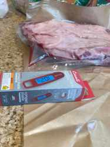
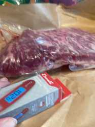

# Smoked Brisket Point v1

## Objective
Learn the baseline flavor and behavior of a small brisket point on the Big Green Egg, with a simple seasoning profile that leaves the pecan/hickory smoke easy to taste.

## Status
In progress

## Equipment
- Big Green Egg / kamado
- Indirect heat deflector
- Grill grate
- Escali folding digital thermometer

## Variables
- Beef: brisket point
- Purchased weight: 3.17 lb
- Price: $8.99/lb ($28.47 total)
- Shape: relatively thin; roughly 1-1.5 inches through much of the piece, closer to ~2 inches at the thicker end
- Cooker target: 250°F indirect
- Seasoning: salt, black pepper, garlic powder
- Smoke wood: Big Green Egg pecan + hickory
- Wood size: pecan pieces are relatively small; hickory pieces larger
- Planned wood load: about 6-8 small pecan pieces + 2 larger hickory pieces
- No commercial rub, specifically to keep the smoke flavor easy to evaluate

## Photos

Raw brisket point before cooking:

## Fire / Setup
1. Light lump charcoal and establish a small fire.
2. Add smoking wood around/near the lit area.
3. Install heat deflector and grill grate.
4. Close the Egg and bring the full setup to ~250°F.
5. Let the cooker stabilize and wait for thick white smoke to transition to thin, clean smoke before adding the meat.

## Cook Plan
- Cook fat side toward the heat source.
- Point the thicker end toward the hotter side of the cooker.
- Because the point is thin, hold closer to 250°F rather than 275°F.
- Leave unwrapped initially to build bark and smoke flavor.
- Consider wrapping once bark is set, likely around 155-165°F internal, rather than waiting for a textbook whole-brisket stall.
- Begin checking earlier than a full brisket; estimated cook window roughly 3-5 hours, with 4-6 hours as a conservative planning range.
- Start probing for tenderness around 190-195°F internal.
- Final doneness is based on probe feel in the thickest section, not a fixed temperature. Expected finish may land around 200-205°F.
- Rest at least 45-60 minutes after cooking.

## Hypothesis
A simple salt/pepper/garlic seasoning and moderate pecan/hickory smoke will make the wood character easy to identify without burying it under a commercial rub. The high-fat point should remain forgiving despite the relatively thin cut, provided it is not overcooked while chasing a specific internal temperature.

## Observations
- First brisket smoke using wood specifically for smoke flavor evaluation.
- Goal is to learn what pecan + hickory tastes like on beef before adding more complex rubs in later cooks.
- Big Green Egg smoking wood pieces were smaller than expected, especially the pecan, so piece count was adjusted upward while keeping total smoke moderate.
- Escali instant-read thermometer replaces a slower-read thermometer and will be used for multi-point tenderness checks near the end of the cook.

## Results
TBD

## Lessons Learned
TBD

## Next Experiment
TBD after tasting and evaluating smoke intensity, bark, tenderness, moisture, and seasoning balance.
